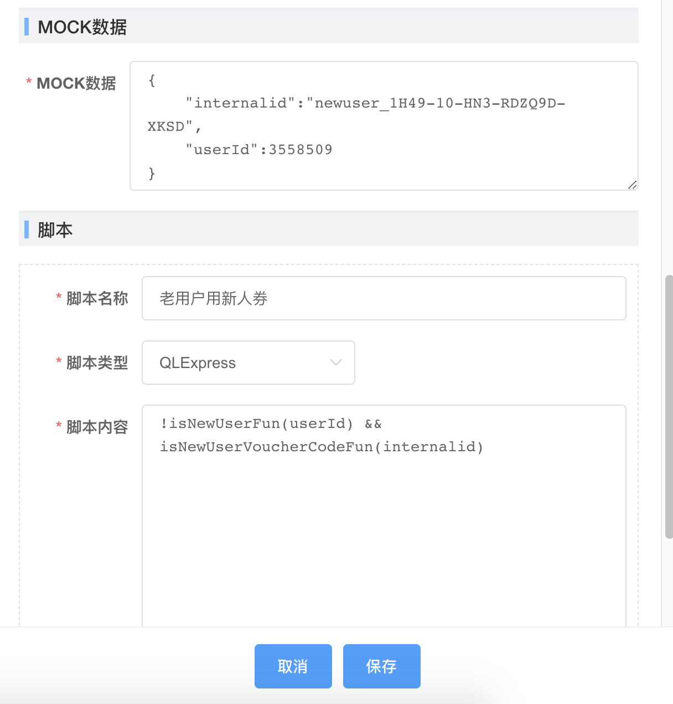
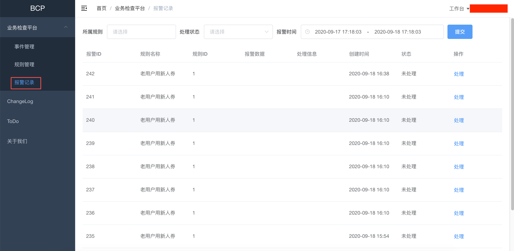

<div align="center">
    
    <br/>
    <h3>ark-bcp  轻松实现业务校验</h3>
</div>

<br/>
<br/>

# 1.什么是ark-bcp？
ark-bcp 是一个基于事件业务校验平台，其核心设计目标是开箱即用、轻量级、易扩展、开放源代码、对业务零入侵。
<bt/>
<div align="center">
    
</div>

# 2.ark-bcp解决了什么问题
ark-bcp通过设置一些列校验规则解决如下问题：
- 促销活动相应单据的一致性
- 主订单与子订单金额一致性
- 主订单与子订单状态匹配
- 逆向交易入退款后，订单款型与退款金额匹配
- 下单后订单有超时信息
- 物流单据生成后，具体是否发货
- 订单历史快照是否完整
- 由于配置问题，老用户领取到了新人券，领取后不能使用，导致客诉。
- 用户支付后推单异常，导致用户迟迟收不到货
- 由于配置原因，某商品价格大幅低于成本价给公司带来损失
- 智能促销创建失败感知不到导致价格没有变更

# 3.ark-bcp特点
- 1、简单：支持通过Web页配置校验规则，1分钟上手；
- 2、业务低入侵：无需特别编辑代码，通过已有MQ消息或者数据库变化监控即可配置校验规则
- 3、支持多种上报方式: 支持RocketMQ、Kafka、数据库变动、Log采集、SDK上报多种方式
- 4、事件过滤：可对上报的事件按照比例、关键参数、自定义规则进行过滤，保留有价值的事件
- 5、多种延时校验策略：支持立即校验、定时校验、延迟指定时间校验、脚本自定义校验时间
- 6、业务自修复：自定义业务修复规则
- 7、规则匹配：根据事件自动匹配校验规则
- 8、易扩展：规则校验执行使用表达式实现，灵活易扩展
- 9、支持多种规则脚本：支持QLExpress、Groovy、Java等语言编写校验规则
- 10、规则编辑：在线规则编辑调试、实时验证
- 11、目前内置数据源：查询是否是新用户、查询用户等级、查询用户标签、查询订单状态、查询SDK当前售价、查询商品基础价格、查询是否新人券
- 12、外部数据源：支持扩展外部数据源
- 13、多种报警方式：短信、电话、邮件、Lark消息等
- 14、按模块上报报警：可按照app_code发送报警、可将报警发送到Lark群组
- 15、报警统计：小时维度统计报警情况
- 16、报警查询：查询报警记录

# 4.ark-bcp服务如何使用？

#### 1.创建事件源
登录BCP系统, 创建事件源，选择上报方式:
- RocketMQ: 监听MQ消息，复用业务已经有MQ消息发出，不侵入业务
- SDK上报: 通过API上报事件，需要接入SDK, 侵入业务

<div align="center">
    
</div>
事件创建完成后处于禁用状态，需要手动启用

#### 2. 创建规则
<div align="center">
    
    
    
</div>

规则创建完成后默认是禁用状态，需要手动启用

#### 3. 报警查询
事件命中规则后，会产生报警记录，可在报警记录中查询。
<div align="center">
    
</div>

#### 4. SDK上报接入

##### 1) 添加maven依赖
```java
<dependency>
    <groupId>com.ark.bcp</groupId>
    <artifactId>ark-bcp</artifactId>
    <version>1.0</version>
</dependency>
```
##### 2) 项目中添加 `bcp.properties`
在 `classpath` 中添加 `bcp.properties` 配置文件，配置文件中应包括 `bcp.url`
```java
# bcp 上报地址
bcp.url=http://127.0.0.1
```

##### 3) 编写上报代码
```java
Map<String, Object> bcpMsgBody = new HashMap<>();
bcpMsgBody.put("userId", userId);
bcpMsgBody.put("internalid", internalid);

/**
  * 业务接入方上报事件消息
  *
  * @param sourceId  事件源ID，对应BCP后台配置的事件源ID
  * @param msgBody
  * @param messageId 业务事件的ID，例如日志的traceId等，可以为空
  */
BcpEventUploader.upload(OLD_USER_VOUCHER_BCP_ID, bcpMsgBody, null);
```

##### 4) 接收报警
命中规则后会发送 Lark Alert 报警


# 5.Contributing
系统还不完善，期待你的参与!!！
比如提交PR修复一个bug，或者讨论新特性或者变更。
让我们共同打造优鲜业务校验平台。
- [Issues](https://github.com/javaboy863/ark-bcp/issues)
